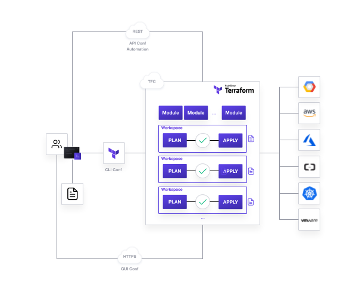

# Terraform Cloud API Python scripts

This repo contains a Python wrapper to interact with [Terraform Cloud API](https://www.terraform.io/docs/cloud/api/index.html). You can do things in CLI style like:
* **List** all TFC (Terraform Cloud) workspaces within an organization or variables from a workspace
* **Create TFC workspaces** or **create variables** in a workspace
* **Copy variables** between TFC workspaces
* **Delete workspaces** in an organization or **delete variables in batch mode** from a workspace
* **Upload a TFC configuration** version and do an [API-Driven run](https://www.terraform.io/docs/cloud/run/api.html) if not using a VCS connection

## Structure of this repo

You will find in this repo three basic group of components:
* Python scripts to interact with Terraform API
* Shell scripts that can be used as easy wrappers
* Some templates files to be loaded from scripts if needed

The structure of the content repo is as follows:
```
tfc-python
|__ oldstuff_isolated_scripts (legacy version of scripts)
|   |__ ...
|__ tfcpy.sh (Bash shell script as a Python wrapper)
|__ pytfc.py.py (Main script to execute any action list|create|delete|upload)
|__ uploadconfig.py (Python module to use API driven workflow)
|__ templates (Templates folder for file parameters)
|   |__ var_payload.json (JSON template for a variable payload)
|   |__ wpayload.json (JSON template for a workspace payload)
|   |__ vars.txt (Text file template to load variables in batch mode)
|__ docs (documentation resources for README)
```

## Some context

### Terraform Cloud and Terraform Enterprise APIs
[Terraform](https://terraform.io) is great. It is broadly extended and practically considered as a "de-facto" standard for multi-cloud infrastructure provisioning. But dealing with a stateful and immutable approach with complex infrastructure provisioning in a collaborative or enterprise environment is not easy as far as you need to share platform states or to deal with policy management. There, it's where [Terraform Cloud (TFC)](https://www.terraform.io/docs/cloud/overview.html) and [Terraform Enterprise (TFE)](https://www.terraform.io/docs/enterprise/index.html) come in place.

So, TFC and TFE are great solutions for **unattended infra provisioning**, **module repo management**, and **team governance**. And their RestFul API lets you work with *workflows-as-code* and integrate with many tools and options.



The nice thing about using TFC/TFE APIs is that lets you to automate any IaC worflow from scratch, even from starting with no Workspaces or Team Management for your Terraform projects. And because it is *API'fied* it is able to be integrated with any platform or solution. Some best practices use cases of using the API instead of CLI or tools plugins are:
* Easy CI/CD pipeline integration
* Easy Release Automation/Orchestration pipeline integration
* In some restricted scenarios, avoiding VCS connection restrictions by triggering runs from external orchestration pipelines (*async* outbound connections)

### Why Python

I started with bash scripting to play around with TFC API using `curl` for REST requests. But I wanted to implement an easy way of developing kind of a CLI tooling to wrap most of my API interactions. So, I thought about Python because:

* It's easy! If I can do Python, anyone can.
* It's very handful to deal with JSON, lists, dictionaries and CLI arguments
* Very straight forward to script REST calls without Curl
* It's portable. Even though that these scripts are MacOS and Linux ready, it should be easy exporting to Windows
* I love indentation... unless it is a YAML file :-)

## How-To Guide
### System requirements
These Python scripts are using Python 3 and only one "non-native" package, so basically these are the requirements:

* Python version 3. (Tested with 3.7.7+)
* `pip3` to install `requests` package. (Tested with version 20.0.2)
* `requests` Python package from [PyPi](https://pypi.org/). (Tested with version 2.23.0)
  * You can install with `pip3 install requests`
  * You can also create a [Python Virtual Environments](https://virtualenv.pypa.io/en/latest/) if you don't want to mess with your global Python installation

## Managing the API Token
These scripts are designed to take your TFC token credential between two options:
* Storing your API token in `$HOME/.terraform.d/credentials.tfrc.json` (This is the recommended, and you can create it from your Terraform CLI 0.12.24+, by executing `terraform login`). If you create it manually:
  ```
  {
    "credentials": {
        "app.terraform.io": {
          "token": <your_api_token>
        }
    }
  }
  ```
* Copying your API token in `TOKEN` environment variable

### Using the script
You can execute the Python scripts using your `python3` command from the CLI. But you can use the included Bash shell script to wrap it (in case of Linux, Unix or MacOS), so the script verifies that your python version is the right one and exists.

```bash
tfcpy.sh <script_arguments_here>
```

Every time you execute a command you will receive a message with the TFC organization you are using and the command you are using for the script. You will need to **press any key to continue** or **Ctrl-C to cancel**. The reason on doing this is because you might be executing a `delete` or other command that you don't want to execute against a wrong TFC organization, so you have a confirmation step.

> NOTE: This confirmation step is implemented in the shell script wrapper, so you won't have it if using the Python script from python execution. 

Check following execution examples:

* Global command help:
    ```
    $ ./tfcpy.sh --help
    Using Python 3.9.7

    Using Terraform API token from "/home/david/.terraform.d/credentials.tfrc.json".
    usage: Terraform API CLI [-h] org {list,create,delete,copy,vars,upload} ...

    positional arguments:
      org                   Terraform organization
      {list,create,delete,copy,vars,upload}
                            sub-command help
        list                listing items
        create              Create workspace
        delete              Delete workspace
        copy                Copy workspace variables
        vars                Create vars
        upload              upload config vars

    optional arguments:
      -h, --help            show this help message and exit
    ```

* Help for a specific command (list workspaces)
    ```
    $ ./tfcpy.sh dcanadillas list --help
    Using Python 3.9.7

    Using Terraform API token from "/home/david/.terraform.d/credentials.tfrc.json".
    usage: Terraform API CLI org list [-h] [-w <workspace>] [--var]

    optional arguments:
      -h, --help      show this help message and exit
      -w <workspace>  Workspace to list
      --var           List variables
    ```

* Listing workspaces:
    ```
    $ ./tfcpy.sh dcanadillas list 
    Using Python 3.9.7

    ========>
    Terraform Organization: dcanadillas
    Commands used: list
    ========>


    Press any key to continue, or Ctrl-C to Cancel...
    Using Terraform API token from "/home/david/.terraform.d/credentials.tfrc.json".
    Parameters selected: Namespace(organization='dcanadillas', cmd='list', w=None, var=False)

    Summary list of names and ids:
    Workspace: demo1 --- id: ws-aJHZrWmd1EqN9xHp
    Workspace: hashicorp-playground --- id: ws-DDVsiM34zdqAVDDW
    ...
    ...
    ```

### The script commands
The `workspaces.py` script is used to manage workspaces and variables from a basic stand point:

* `list`
  
  > NOTE: `pagination` is already implemented, so you will see all listing results, but need to be improved.
  * List all workspaces in a TFC organization
    ```
    tfcpy.sh <organization> list
    ```
  * Show details of a workspace and listing its variables
    ```
    tfcppy.sh <organization> list -w <workspace>
    ```

* `create`
  * Create a workspace in a TFC organization
    ```
    tfcpy.sh <organization> create <workspace_name> [--json <workspace_payload_json_file>]
    ```

* `delete`
  * Delete a workspace from a TFC organization 
    ```
    tfcpy.sh <organization> delete <workspace_name>
    ```
  * Delete variables in a workspace
    ```
    tfcpy.sh <organization> delete <workspace_name> \
    --var <varname1> <varname2> ...
    ```

* `copy`
  * Copies a source workspace from a TFC organization to a destination workspace in the same organization
    ```
    tfcpy.sh <organization> copy <src_workspace_name> <dest_workspace_name>
    ```


* `vars`
  * Create variables in a workspace from CLI values (as environment variables with `--env`)
    
    *(If the variable already exists it will update the value)*
    ```
    tfcpy.sh <organization> vars <workspace_name> \
    -v <var1_name> <var1_value -v <var2_name> <var2_value> [--env]
    ```
  * Create variables in a workspace from CSV text file (Format: `name`,`value`,`category[env|terraform]`,`sensitive[true|false]`. First row is ignored)
    ```
    tfcpy.sh <organization> vars <workspace_name> \
    -f <csv_file_path>
    ```
  * Create variables in a workspace from a Terraform `tfvars` file (Format: `key = "value"` )
    ```
    tfcpy.sh <organization> vars <workspace_name> \
    -f <csv_file_path>
    ```
  * Create Google Cloud Platform credentials variable from a key JSON GCP file
    ```
    tfcpy.sh <organization> vars <workspace_name> \
    --gcp <gcp_key_json_filepath>

You can execute the help menu for every command with `-h` or `--help` argument.

  * Uploading a configuration by the [API-Driven run](https://www.terraform.io/docs/cloud/run/api.html) when you are not using a [VCS integration](https://www.terraform.io/docs/cloud/vcs/index.html) with TFC/TFE. This can be very helpful when you cannot use the VCS connection for networking reasons and want to use your CI/CD pipelines or Release Orchestration pipelines to automate infra provisioning triggered to TFC using the API.

  The steps followed by `upload` command is:
  1. It creates a `tar.gz` file from your Terraform Configuration directory
  2. It creates a [Configuration Version](https://www.terraform.io/docs/cloud/api/configuration-versions.html) in TFC using the API
  3. It checks the `pending` Configuration Versions (they may were created, but not uploaded) and asks to use one of them if wanting to
  4. It creates a new Configuration Version if there are no pending ones, or if want to create a new one
  5. It uploads the terraform project to the Configuration Version.
  6. It queues the plan depending on the argument `--run`

  The usage is pretty straight forward:

  If you don't pass any arguments it takes some default values:
  - `-d ./`
  - `-f tfc-upload.tar.gz`
  - `--run true`

  So, to upload your Terraform configuration from the current directory:
  ```bash
  tfcpy.sh <organization> upload <workspace>
  ```

## Use cases
> WIP: This is a Work In Progress

### Terraform unattended provisioning for CI/CD pipelines
> TODO: Content pending

### Quickstart ephemeral workspaces for Development
> TODO: Content pending


 